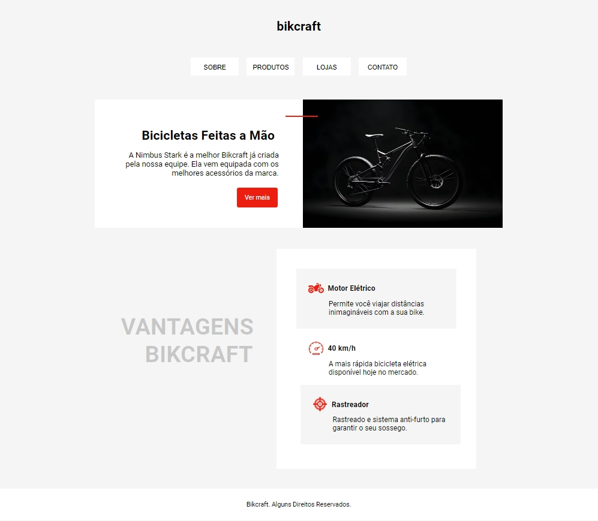

# EXERCÍCIO BIKCRAFT 🚲
Este é um site chamado **Bikcraft** que apresenta bicicletas feitas à mão. A página principal destaca a bicicleta Nimbus Stark, considerada a melhor Bikcraft já criada pela equipe, equipada com os melhores acessórios da marca. 

Link para a visualização do site: https://emillysmoitinho.github.io/bikcraft/

## Descrição
O site tem uma seção de "Vantagens Bikcraft", onde são descritas três principais características: 
* Motor Elétrico, que permite viagens longas; 
* Velocidade máxima de 40 km/h, destacando-se como a bicicleta elétrica mais rápida disponível no mercado; 
* Sistema de rastreador anti-furto para garantir segurança.

## Tecnologias Utilizadas
* HTML
* CSS
***
Este projeto foi desenvolvido por mim sozinha no Academy One, utilizando apenas HTML e CSS. 

Foi um exercício para treinar e aprimorar meus conhecimentos nessas tecnologias.

 
